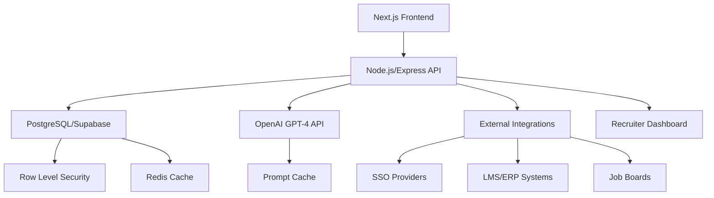
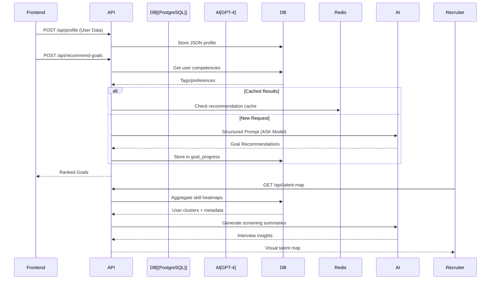
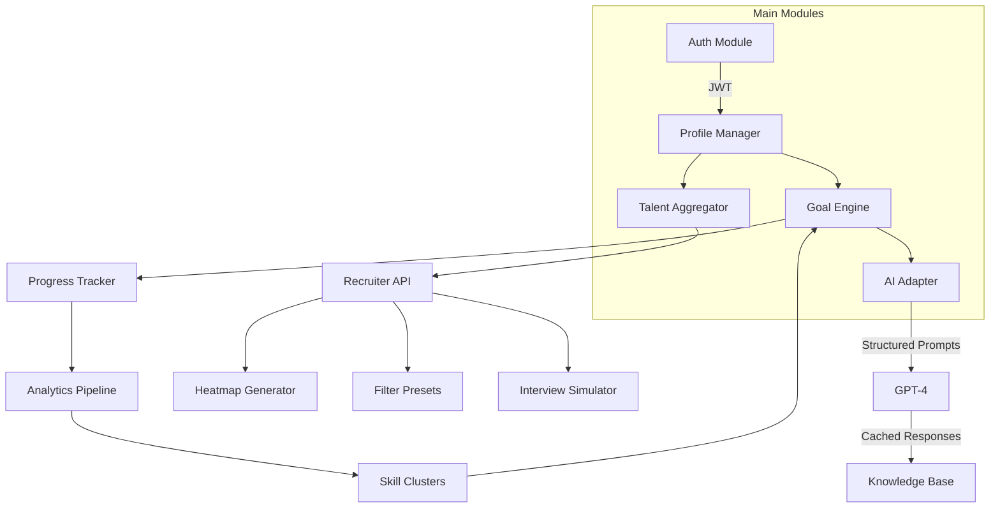
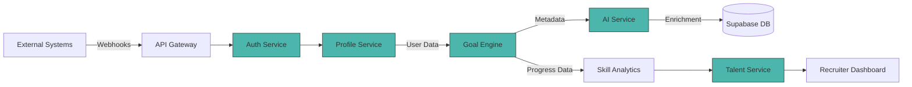

Here's a technical architecture overview using Mermaid.js diagrams that visualize the tech stack and data flows:

### 1. Tech Stack Diagram


**Key Components:**
- **Frontend**: Next.js (SSR/API routes)
- **API Layer**: Express.js (REST) with Swagger docs
- **Database**: PostgreSQL (Supabase) with JSONB columns
- **AI Engine**: GPT-4 + Prompt Templates
- **Security**: Supabase Auth + RLS Policies
- **Integrations**: Webhooks for external systems
- **Caching**: Redis (API responses) + Prompt Cache

---

### 2. Core System Flow


---

### 3. Module Interaction Diagram


---

### 4. Data Flow Architecture


---

### Key Technical Decisions:
1. **AI Integration Pattern**:
   ```mermaid
   graph LR
       Request-->PromptEngine[Prompt Template Engine]
       PromptEngine-->|System Message| LLM[GPT-4]
       PromptEngine-->|User Context| LLM
       LLM-->Parser[Response Parser]
       Parser-->Cached[(Vector Cache)]
       Parser-->DB[(Profile DB)]
   ```

2. **Scalability Approach**:
   - Phase 1: Monolithic Node.js + PostgreSQL
   - Phase 2: Microservices (Go containers) + GraphQL
   - Phase 3: Skill embeddings in pgvector/Pinecone

3. **Security Layers**:
   ```mermaid
   graph TD
       Client -->|HTTPS| CDN
       CDN -->|OAuth2| API[API Gateway]
       API -->|RLS Policies| DB[(Supabase)]
       DB -->|Encryption| Storage[Object Storage]
   ```

4. **Talent Visualization Pipeline**:
   ```mermaid
   flowchart LR
       DB --> Aggregator[Skill Aggregator]
       Aggregator --> Cluster[K-Means Clustering]
       Cluster --> Heatmap[Canvas Heatmap Generator]
       Heatmap --> Dashboard[(React Dashboard)]
       Dashboard -->|WebSockets| RealTime[Live Updates]
```

This architecture provides:
- Real-time personalization via GPT-4 + PostgreSQL triggers
- Recruiter talent discovery through aggregated skill matrices
- Horizontal scaling using Supabase realtime capabilities
- Audit trails for all AI-generated content
- GDPR-compliant data handling with automatic anonymization

For production deployment, I recommend:
1. Vercel for frontend/API hosting
2. Supabase PRO tier for RLS and realtime
3. Redis Cloud for caching
4. Prometheus/Grafana for monitoring
5. CI/CD with GitHub Actions
